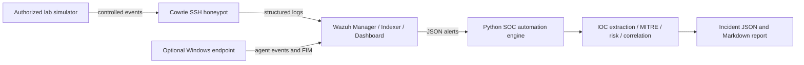

# Enterprise Threat Detection & Automated Incident Response Lab

> A controlled, isolated SOC portfolio lab for detection engineering, alert triage, MITRE ATT&CK mapping, and explainable incident automation. It does **not** target public, workplace, or third-party systems.

## Project status

The repository contains the reproducible low-resource foundation: isolated Cowrie/SOC-engine Compose configuration, custom Wazuh content awaiting environment validation, a standard-library Python triage engine, a benign YARA rule, incident playbooks, and a formal test plan. Wazuh deployment and dashboard evidence are deliberately marked pending until validated on a dedicated Wazuh-capable node.

## Architecture



The planned local network is Docker bridge `172.28.0.0/24`; Cowrie is bound to loopback on TCP `2222`. The full Wazuh server belongs on a separate node because the development host has 8 GB RAM. See [architecture notes](architecture/architecture.md).

## Objectives

- Generate safe, attributable security events inside an authorized lab.
- Ingest and detect Cowrie and endpoint events in Wazuh.
- Build explainable custom detections, FIM coverage, and MITRE mappings.
- Extract IOCs with validation and optional, secret-free enrichment.
- Correlate related alerts and generate evidence-oriented incident reports.
- Document testing honestly: verified, pending, and future work are never conflated.

## Technologies

| Area | Technology |
|---|---|
| SIEM/XDR | Wazuh manager, indexer, dashboard, agents |
| Honeypot | Cowrie |
| Automation | Python 3 standard library |
| Detection | Wazuh XML, YARA, planned Sigma |
| Documentation | Markdown, Mermaid, Git |
| Framework | MITRE ATT&CK |
| Runtime | Docker Compose / isolated bridge network |

## Repository map

```text
enterprise-threat-detection-lab/
├── architecture/                 # Architecture and network planning
├── attack-scenarios/             # Authorized scenario catalog
├── detection/                    # YARA and MITRE coverage
├── docs/                         # Test plan and troubleshooting
├── honeypot/                     # Cowrie space for validated configuration
├── incident-response/            # Report template and playbook
├── soc-automation-engine/        # Python alert-to-incident utility
├── wazuh/                        # Custom decoder and rules
└── docker-compose.yml            # Internal, loopback-only lab services
```

## Safe setup sequence

1. **Windows host:** enable a supported Linux container runtime (Docker Desktop with WSL 2) during Phase 2. Keep virtualization isolated from your normal network where possible.
2. **Dedicated Wazuh host:** deploy the current Wazuh single-node stack only on a system with sufficient memory and storage. Confirm current official Wazuh documentation before using installation commands.
3. **Local lab:** start Cowrie only with the loopback port mapping in `docker-compose.yml`; do not publish it through a router or cloud firewall.
4. **Detection validation:** validate Cowrie events using `wazuh-logtest`, then confirm decoder fields and rules against your installed Wazuh version.
5. **Automation:** process a supplied alert offline before connecting live Wazuh alerts.

## Python automation

From `soc-automation-engine`:

```bash
python src/main.py data/sample_alerts/cowrie-bruteforce.json --output data/output
python -m pytest tests
```

The engine creates a structured incident object and Markdown report. Its risk model is intentionally explainable, not scientifically validated:

```text
Wazuh rule level × 5 (maximum 50)
+ 10 or 20 for related alerts
+ 25 for confirmed malicious reputation
+ 15 for a critical asset
= LOW / MEDIUM / HIGH / CRITICAL
```

Threat-intelligence enrichment is disabled by default and the application continues when no API key exists. Never commit `.env` files or credentials.

## Detection engineering

The included Cowrie decoder and custom rules are starting points that must be validated against actual Cowrie JSON before use:

| Rule | Behavior | ATT&CK | Notes |
|---:|---|---|---|
| `100100` | Cowrie event observed | Context | JSON parent rule |
| `100101` | Failed SSH authentication | T1110 | Single event triage |
| `100102` | Five failed SSH events in 120 seconds | T1110 | Source correlation after field validation |
| `100103` | Command entered in honeypot | T1059 | Preserve session evidence |

See [rules](wazuh/rules/cowrie_rules.xml), [decoder](wazuh/decoders/cowrie_decoders.xml), and the [MITRE coverage matrix](detection/mitre/coverage-matrix.md).

## Controlled scenarios and response

| Scenario | Evidence | Response focus |
|---|---|---|
| SSH failed-authentication pattern | Cowrie events and Wazuh alert | Scope source/session and validate follow-on activity |
| Network discovery | Lab-only connection evidence | Confirm target scope and correlate activity |
| Command execution | Cowrie session JSON | Preserve evidence and assess intent |
| FIM | Wazuh file-change event | Validate authorization and compare change evidence |
| Safe persistence indicator | Non-executing lab configuration file | Review change, remove after authorization |
| EICAR test artifact | YARA match | Confirm benign test artifact and clean up |

The [scenario catalog](attack-scenarios/README.md) and [SSH response playbook](incident-response/playbooks/ssh-brute-force.md) define safe operating boundaries.

## Testing and evidence

The test plan separates automated results from Wazuh integration results. Start with the Python unit tests, then perform Wazuh rule tests and scenario tests only inside the lab. See [test plan](docs/test-plan.md).

Recommended portfolio screenshots, once the environment is running:

1. Wazuh dashboard alert overview with lab data only.
2. Cowrie failed-login event details.
3. Custom-rule alert showing MITRE metadata.
4. FIM create/modify/delete evidence.
5. Generated Python incident Markdown/JSON output.

## Incident workflow

```text
Preparation → Detection → Analysis → Containment → Eradication → Recovery → Lessons Learned
```

Use the [incident report template](incident-response/templates/incident-report.md) and preserve raw evidence outside Git whenever it contains sensitive data. Commit only sanitized samples.

## Troubleshooting

See [troubleshooting guidance](docs/troubleshooting.md) for Cowrie startup, Wazuh ingestion and rule matching, Python output, and optional API-enrichment issues.

## Future improvements

- Validate rules and decoder fields with a dedicated current Wazuh deployment.
- Add a Windows agent and Sysmon telemetry if hardware permits.
- Add time-window correlation across multiple alert files.
- Add an audited optional VirusTotal/AbuseIPDB client with rate limiting.
- Add Sigma source rules and a documented conversion/validation workflow.
- Add dashboard screenshots and sanitized incident evidence after successful tests.
