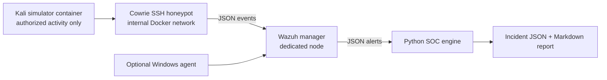

# Low-Resource Architecture

The local Docker network is internal and Cowrie is bound only to `127.0.0.1:2222`. A separate Wazuh node is required for the manager, indexer, and dashboard because the project host has 8 GB RAM.
